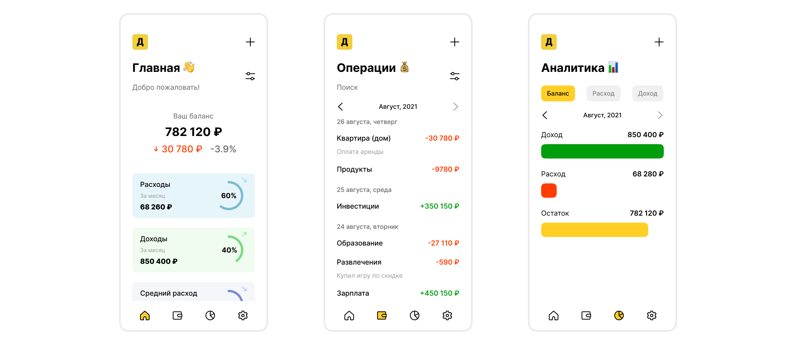

# Денежки – самый легкий учет финансов 💰

Простой инструмент для учета расходов и доходов. Это бесплатно, быстро и просто. Открытый исходный код. Без лишних
функций и подписок. Различные отчеты за период. Подойдет для людей, желающих вести учет своих трат и понимать, на что
они тратят денег больше всего, не разбираясь в сложных системах.



## Возможности

- Записи расходов и доходов по категориям с комментариями
- Статистика по категориям за период в виде диаграмм
- Просмотр разницы доход / расход по месяцу
- Переименование категорий после создания
- Просмотр суммы операций за день и процент от баланса
- Поиск операций по сумме или комментарию
- Смена пароля и выбор валюты
- Замена и удаление категории вместе с операциями
- Задать вопрос в приложение и получить на него ответ

## Технологии

> MongoDB + Express + React + NodeJS (MERN) + GraphQL + Apollo

## Начало работы

### 1. Установка

Скопируйте репозиторий и установите зависимости

```shell
git clone https://github.com/nblackninja/expense-tracker.git
cd expense-tracker 
npm install
```

## Примечание

Если у вас есть пожелания или проблемы с использованием приложения, пишите на
почту [nikitayudin782@gmail.com](mailto:nikitayudin782@gmail.com)

## Лицензия

Исходный код опубликован под лицензией MIT, которая доступна [здесь](LICENSE). 
